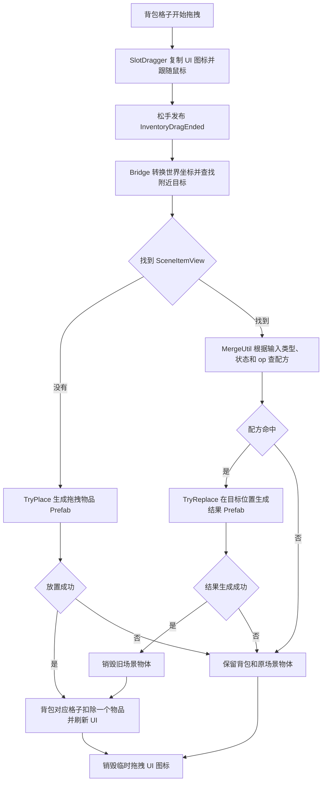

# 背包拖拽、场景放置与融合替换

当前已经接通「拖拽时显示 UI Sprite，松手后生成场景 Prefab，融合后替换旧 Prefab」这条流程。2026-10-07，开发者在 Unity 中运行并确认本次流程验证成功。

本文记录当前代码、场景配置和使用方式。完整配方见 [item-merge.md](item-merge.md)，物品类型与状态见 [item-catalog.md](item-catalog.md)。

## 当前场景和资源

| 配置项 | 当前内容 |
| --- | --- |
| 验证场景 | `Assets/Scenes/SampleScene.unity` |
| 场景入口对象 | `SceneItemSystem` |
| 场景组件 | `SceneItemSpawner`、`SceneItemInteractionController`、`SceneItemDragDropBridge` |
| 世界相机 | 场景中的 `Main Camera` |
| Prefab 映射表 | `Assets/Config/Item/ItemPrefabCatalog.asset` |
| 临时场景 Prefab | `Assets/Prefabs/Scene/Items/DebugItem.prefab` |
| 背包图标表 | `Assets/Config/UI/HUD/Inventory/Sprite2ItemTable.asset` |
| 临时 Sprite | `Assets/UI/Sprite/HUD/Inventory/Square.png` |
| 配方源表 | `ExcelData/ItemMergeTable.xlsx` |

Catalog 当前有 17 个「完整类型名 + State」条目，都引用同一个 `DebugItem.prefab`。背包图标表有 12 个物品类型，也统一使用 `Square.png` 占位。

物品外观相同，但数据仍有区别：树苗绑定 `GamePlay.Core.Item_Tree`、`State=0`，大树绑定相同类型、`State=1`。融合会创建新的 Prefab 实例并绑定结果数据；当前占位 Prefab 不会随状态自动改变尺寸或颜色。

## 完整调用流程



当前流程分为三个阶段：

1. 拖拽中：只移动复制出来的 UI 图标，原背包数量保持不变。
2. 松手时：生成场景 Prefab，或查询配方后生成结果 Prefab。
3. 场景处理成功后：销毁融合目标、扣除背包一个物品，清理临时 UI 图标；失败则保留原背包内容和场景目标。

## 类的职责和代码位置

| 类 | 命名空间 | 职责 | 代码位置 |
| --- | --- | --- | --- |
| `InventoryController` | `UI.GamePlay.HUD` | 绑定背包模型，监听更新并刷新视图 | `Assets/Scripts/UI/GamePlay/HUD/Inventory/InventoryController.cs` |
| `InventoryViewer` | `UI.GamePlay.HUD` | 创建格子，把模型和格子下标传给各自的拖拽组件 | `Assets/Scripts/UI/GamePlay/HUD/Inventory/InventoryViewer.cs` |
| `SlotDragger` | 全局命名空间 | 复制和移动 UI 图标，松手时发布拖拽数据 | `Assets/Scripts/UI/GamePlay/HUD/Inventory/SlotDragger.cs` |
| `InventoryDragContext` | `GamePlay.Inventory` | 保存背包模型、格子下标、Item 副本和屏幕位置 | `Assets/Scripts/GamePlay/Inventory/InventoryDragContext.cs` |
| `SceneItemDragDropBridge` | `GamePlay.Scene` | 接收事件，转换坐标、查找目标、选择 op，成功后扣除背包 | `Assets/Scripts/GamePlay/Scene/SceneItems/SceneItemDragDropBridge.cs` |
| `SceneItemInteractionController` | `GamePlay.Scene` | 提供 `TryDrop`、`TryPlace`、`TryMerge` 入口 | `Assets/Scripts/GamePlay/Scene/SceneItems/SceneItemInteractionController.cs` |
| `MergeUtil` | `GamePlay.Core` | 按 Excel 配方返回结果 Item | `Assets/Scripts/GamePlay/Core/Merge/MergeUtil.cs` |
| `ItemPrefabCatalog` | `GamePlay.Scene` | 按完整类型名与 State 查找 Prefab | `Assets/Scripts/GamePlay/Scene/SceneItems/ItemPrefabCatalog.cs` |
| `SceneItemSpawner` | `GamePlay.Scene` | 实例化并绑定 Item，成功后替换旧物体 | `Assets/Scripts/GamePlay/Scene/SceneItems/SceneItemSpawner.cs` |
| `SceneItemView` | `GamePlay.Scene` | 保存场景实例对应的 Item 类型与 State | `Assets/Scripts/GamePlay/Scene/SceneItems/SceneItemView.cs` |
| `SceneItemMergeTarget` | `GamePlay.Scene` | 可选组件，为目标配置 Operation | `Assets/Scripts/GamePlay/Scene/SceneItems/SceneItemMergeTarget.cs` |

`Item` 是纯物品数据，UI Sprite 是拖拽表现，Prefab 是场景对象。场景 Prefab 通过 `SceneItemView` 关联到 Item，融合匹配使用的是 Item 类型和 State。

## 拖拽事件和背包数量

事件定义位于 `Assets/Scripts/Common/Event/GameEvents.cs`：

| 事件 | 参数类型 | 当前用途 |
| --- | --- | --- |
| `ModelBinded` | `InventoryModel` | 将背包模型绑定到 UI |
| `SlotBeginDragged` | `GameObject` | 通知 UI 图标开始拖拽 |
| `SlotEndDragged` | `GameObject` | 保留原有 UI 松手通知 |
| `InventoryDragEnded` | `InventoryDragContext` | 将完整松手数据交给场景桥接器 |

`InventoryDragContext` 在 `SlotDragger.OnEndDrag` 中创建：

| 属性 | 含义 |
| --- | --- |
| `Inventory` | 来源背包模型 |
| `SlotIndex` | 来源格子下标，从 0 开始 |
| `Item` | 松手时从格子数据复制得到的 Item |
| `DragObject` | 本次拖拽的临时 UI GameObject |
| `ScreenPosition` | 松手时 `PointerEventData.position` 的屏幕坐标 |

`SceneItemDragDropBridge` 在启用时订阅 `InventoryDragEnded`，停用时取消订阅。事件同步处理完成后，`SlotDragger` 销毁拖拽 UI 图标。

桥接器仅在 `TryDrop` 返回 `true` 后调用 `Inventory.GetItem(SlotIndex)`。这个方法会扣除该格子一个物品，并触发 `OnInventoryUpdated` 刷新数量；数量变为 0 时清空格子。失败时没有先扣除物品，因此不需要额外放回背包，也没有返回动画。

## Bridge 的 Inspector 配置

在 `SampleScene` 中选中 `SceneItemSystem`，`SceneItemDragDropBridge` 当前字段如下：

| 字段 | 当前值 | 用途 |
| --- | --- | --- |
| `_interaction` | 同一对象上的 `SceneItemInteractionController` | 场景放置和融合入口 |
| `_worldCamera` | `Main Camera` | 将松手屏幕坐标转换为世界坐标 |
| `_sceneParent` | `None` | 空地生成的物体放在场景根节点 |
| `_worldZ` | `0` | 当前放置平面的世界 Z 坐标 |
| `_targetRadius` | `0.5` | 查找目标的最大距离，单位为世界单位 |
| `_defaultOperation` | `1` | 目标没有操作组件时使用的 op |

当前相机朝向沿世界 Z 轴，Bridge 用 `_worldZ - camera.position.z` 作为屏幕到世界的转换深度。

目标检测通过 `FindObjectsByType<SceneItemView>` 获取活动场景物品，比较其 Transform 位置与落点的距离，在半径内选择最近的目标。这一步按距离查找，不依赖物理射线、Collider 或 Trigger。

拖拽图标可以按 `ItemAttachRuler` 在屏幕上吸附，但 Bridge 使用的是松手时的原始屏幕坐标。当前没有将放置点吸附到世界网格。

## 当前可复现的操作步骤

1. 在 Unity 中打开 `Assets/Scenes/SampleScene.unity`，进入 Play Mode。
2. 场景中的 `Tester` 创建 10 格背包：水放在下标 `1`，树苗放在下标 `2`。
3. 从背包把树苗拖到场景空地并松手。出现一个占位方块，绑定 `Item_Tree`、`State=0`，背包树苗数量减 1。
4. 把水拖到树苗附近，在距离树苗中心约 `0.5` 个世界单位以内松手。
5. 当前目标没有 `SceneItemMergeTarget`，因此 Bridge 使用默认 `op=1`。
6. 配方返回 `Item_Tree`、`State=1`；生成器在树苗原位置创建新 Prefab，并销毁旧树苗实例。
7. 背包水数量减 1，临时 UI 图标被销毁。

对应成功日志：

```text
[SceneItemDragDropBridge] 放置成功：GamePlay.Core.Item_Tree State=0
[SceneItemDragDropBridge] 融合成功：GamePlay.Core.Item_Tree State=1
```

这里先放树苗、再拖水，结果以树苗为位置锚点。先放水、再拖树苗也能匹配同一配方，但结果位置会取已放置水的位置，因为 `MergeUtil` 支持输入顺序互换，而替换锚点始终是已有场景目标。

在 Hierarchy 中选中新对象，可以通过读取 `SceneItemView.State` 或查看成功日志确认结果状态。

## 提供给交互系统的接口

以下为调用片段，`interaction` 为场景中的 `SceneItemInteractionController`，调用代码使用 `GamePlay.Core`、`GamePlay.Scene` 和 `UnityEngine` 命名空间。

### 从物品数据放置到空地

```csharp
bool success = interaction.TryDrop(
    draggedItem,
    worldPosition,
    Quaternion.identity,
    sceneParent,
    null,
    0,
    out SceneItemView placedView
);
```

`target=null` 时调用 `TryPlace`。该路径生成拖拽物品自身的 Prefab，`op` 不参与处理。成功返回 `true` 和 `placedView`，生成失败返回 `false`。

### 拖到已有场景物体并融合

```csharp
bool success = interaction.TryDrop(
    waterItem,
    treeView.transform.position,
    Quaternion.identity,
    treeView.transform.parent,
    treeView,
    1,
    out SceneItemView replacement
);
```

`target` 不为空时调用 `TryMerge`，读取目标的 Item 副本，并执行：

```csharp
Item result = MergeUtil.Merge(draggedItem, targetItem, op);
```

非泛型重载按配方的 `typeOut` 和 `stateOut` 返回结果，不要求调用方提前知道结果类。没有配方时返回 `null`。

`TryDrop` 本身不扣除背包；当前由 `SceneItemDragDropBridge` 负责成功后的扣除。其他交互系统直接调用时，也由其持有的背包流程负责扣除。已经通过 Bridge 发布拖拽事件的调用方不需要再次扣除。

### 两个场景物体的融合接口

```csharp
bool success = interaction.TryMerge(
    waterView.Item,
    treeView,
    1,
    out SceneItemView replacement,
    waterView
);
```

`treeView` 作为结果锚点，`waterView` 作为额外消耗物体。生成成功后，两者都被销毁。此接口已提供；当前 `SlotDragger` 只处理背包拖拽，没有接入场景物体的拖拽输入。

### 单独生成与替换

```csharp
SceneItemView view = spawner.Spawn(
    item,
    worldPosition,
    Quaternion.identity,
    sceneParent
);

bool replaced = spawner.TryReplace(
    resultItem,
    targetView,
    out SceneItemView replacement,
    additionalConsumedView
);
```

`Spawn` 失败时返回 `null`；`TrySpawn` 和 `TryReplace` 失败时返回 `false`。`TryReplace` 的可选尾部参数可以传入多个需要消耗的场景物体。

## Prefab 生成、绑定和安全替换

Catalog 查找键为：

```text
完整类型名#State
```

例如 `GamePlay.Core.Item_Tree#0` 与 `GamePlay.Core.Item_Tree#1` 是两个不同条目。同一物品不同状态可以指向不同 Prefab；目前 `Sprite2ItemTable` 仅按类型查找，所以同类不同状态共用一个背包图标。

`SceneItemSpawner.Spawn` / `TrySpawn` 的顺序为：

1. 从 Catalog 查找类型和 State 对应的 Prefab。
2. 按传入的位置、旋转和父节点实例化。
3. 查找根节点的 `SceneItemView`，没有时自动添加。
4. 调用 `TryBind` 保存 Item 副本。
5. 返回绑定完成的场景对象。

`SceneItemView.Item` 和 `TryGetItem` 返回物品副本，外部读取不会直接修改组件内的数据。

`TryReplace` 先生成结果，再销毁旧实例。结果的位置、旋转和父节点均取自目标锚点；额外消耗物体会去重。旧物体用 Unity 的 `Destroy` 销毁，在帧末生效。如果结果 Prefab 查找或绑定失败，原场景物体保留。

| 场景处理结果 | 背包变化 | 场景目标变化 |
| --- | --- | --- |
| 空地放置成功 | 来源格子减 1 | 新增场景实例 |
| 配方命中且结果生成成功 | 来源格子减 1 | 新结果替换旧目标 |
| 没有匹配配方 | 不扣除 | 保留旧目标 |
| Catalog 没有对应 Prefab | 不扣除 | 保留旧目标 |

正式资源的配置位置是 Catalog 的 `Entries`。把占位引用替换成对应 Prefab 后，生成和替换会使用新资源；类型名、State 与 Excel 配方保持对应。正式 Prefab 根节点可以预挂 `SceneItemView`，未预挂时生成器会补上。

## op 与当前实现范围

Bridge 先读取目标根节点上 `SceneItemMergeTarget.Operation`，没有这个组件时使用 `_defaultOperation`。组件只是提供一个整数操作号，不会读取昼夜、阳光或输入道具，也不会随目标 State 自动改变。

目前默认 `op=1` 用于验证水与树苗配方。代码尚未接入直射阳光条件，当前即使没有阳光判断也会尝试这个配方。孢子、蕨类等操作号定义见 [item-merge.md](item-merge.md)；环境判断与操作选择由交互或环境系统提供。

当前已经验证的是背包物品进入场景并参与融合替换的基本流程。以下行为还没有接入这条通用 Bridge：

- 世界网格有效格、占用和 UI 区域的落点判断；
- 场景已有物体的鼠标拖拽；
- 铲取结果进入背包，以及铲子保留规则；
- 风种生成实际风场、方向选择和秒表切换昼夜；
- 存档恢复与正式美术表现。

通用 Bridge 当前会把所有配方结果作为场景 Prefab 生成，成功后扣除一个来源背包物品。铲取回背包等特殊规则尚未单独分流。

## 验证记录

- 修正 `SceneItemDragDropBridge` 的 `GamePlay.Core` 引用后，Unity 重新编译返回 `failed=false`、`errors=[]`。
- 目标查找使用 Unity 6 的 `FindObjectsByType`。
- `DebugItem.prefab` 已被 AssetDatabase 识别，Catalog 17 条映射已引用该资源。
- 开发者反馈「可以了，成功了」，确认本次运行验证通过；这不代表已经逐条验证全部 13 条配方或接入了上述特殊玩法。
